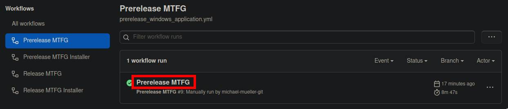
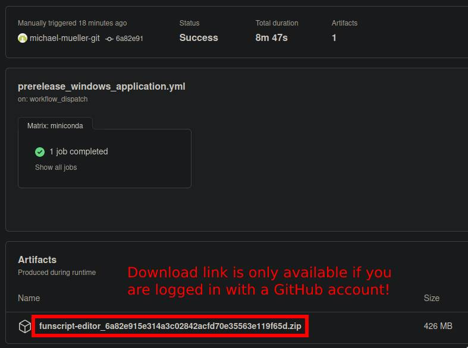

# Notes for Developer

## Prerelease Version of MTFG

Sometimes it is useful to test new functions and verify the correctness of changed code. Therefore we use [Prereleases with GitHub Actions](https://github.com/michael-mueller-git/Python-Funscript-Editor/actions/workflows/prerelease_windows_application.yml) to create a Executable without releasing the Application to the public. **This release type can only be downloaded when you login to an GitHub Account!** Each prereleases are only available vor limited time to download. Currently i have set the retention time to 7 days.
<br> 
<br> 

### Installation

There is no automated way to install the prereleases since they are indented for developer and technical experienced test users. To install the prerealese you have to extract the downloaded Prerelease to `%APPDATA%\OFS\OFS_dataX\extensions\Funscript Generator Windows\funscript-editor`. Therefore first delete the `funscript-editor` folder in `%APPDATA%\OFS\OFS_dataX\extensions\Funscript Generator Windows`. And create a new one with the content of the Prerelease. The preerelease now can be used as OFS extension. Note: For prereleases the version may be displayed incorrectly because there is no official release tag. To switch back to the latest official release delete the `funscript-editor` folder in `%APPDATA%\OFS\OFS_dataX\extensions\Funscript Generator Windows` and run the `mtfg-ofs-extension-installer.exe` from [latest GitHub release](https://github.com/michael-mueller-git/Python-Funscript-Editor/releases/tag/latest).

## Development on Windows

I have only a Winows KVM with gpu passthrough for testing, therefore i do not know very much about the development of python applications on Windows. For testing i use the `build_and_deploy.bat` script from the repository root directory.

## Pushing to multiple git repositories

Use the following to add several pushurls to your origin:

```bash
git remote set-url --add --push origin git://original/repo.git
git remote set-url --add --push origin git://another/repo.git
```

Now you can use `git push` to push changes to multiple git repositories.

## GitHub Release API

Get all release information:

```bash
curl -H "Accept: application/vnd.github.v3+json" https://api.github.com/repos/michael-mueller-git/Python-Funscript-Editor/releases
```
