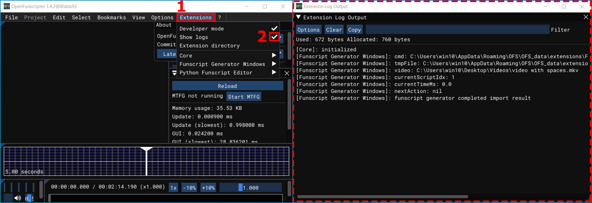

# Open Funscripter Integration

## Installation Windows Option 1 (Easy)

If you use an older version (`v0.0.x`), i recommend to first delete the `funscript_generator_windows.lua` script in `C:\Program Files\OpenFunscripter\data\lua`.

1. Download OFS from https://github.com/OpenFunscripter/OFS/releases. **(min required OFS Version 1.4.2!!!)**
     
2. Install OFS
     
3. Start OFS at least once and close it again.
     
4. Download the MTFG OFS Extension Installer from https://github.com/michael-mueller-git/Python-Funscript-Editor/releases.
     
5. Execute the downloaded executable. Wait for the installation to complete.
     
6. Open OFS, activate the extension (3) and enable the window (4). Now you can use the extension at any position in the Video with the _Start MTFG_ Button (5). On slow computers, the program may take several seconds to start!. Before you press the _Start MTFG_ Button you have to open a video in OFS else you get only the Message Box "Video file was not specified!".
     
7. **Optional**: Add global key binding for the extension in OFS.
     
8. **Troubleshot**: If you have any problems that can not be solved with the Troubleshot section below please post an screenshot of the following log output window after you have try to run the Generator at least once:
     

 
 

**NOTE: I have removed Installation Option 2 due to problems with data transfer to OFS. You should switch to Install Option 1!**

### What does the installer do?

This section for technical interested people who want to understand the installation process. The source code of the installer is in the [`contrib/Installer`](https://github.com/michael-mueller-git/Python-Funscript-Editor/tree/main/contrib/Installer) directory of this repository. The installer perform the following Steps:

1. Check if the OFS Extension Directory `%APPDATA%\OFS\OFS_data\extensions` exists.
2. Fetch the latest release Version from github rest api.
3. Check if an (older) MTFG Version is already installed in the OFS Extension Directory: If we have already the latest version installed, we are done here
4. The installer download the latest release version from github.
5. After the download complete we extract the latest release to the OFS Extension Directory (Installation of the latest release).
6. Finally we download the [latest OFS Extension lua script](https://github.com/michael-mueller-git/Python-Funscript-Editor/blob/main/contrib/Installer/assets/main.lua) to the OFS Extension Directory.

## Troubleshot

### When calling the generator, only a message box is displayed with the message: "Video file was not specified!"

In some cases OFS does not set the path to the video file within the lua script correctly (the variable `VideoFilePath` is empty). This happen when the video path contains some special character like square braked `[` and `]`. **Rename your video files and store them in a path without special character**. Then the variable should be set by OFS and the motion tracking funscript generator should work.

### Tracking stops automatically

If a tacker does not find the selected feature in the next frame, the tracking process stops. If more than 90 frames have already been tracked, a window appears to select the minimum and maximum value in which the reason for the abort is displayed with e.g. `Info: Tracker Woman Lost`.

If less than 90 frames have been processed, a message box should pop up with the message `Tracking time insufficient`. In this case, no output is generated because there is not enough data for the algorithm to work with.

### Tracking stops very often

The selection of the tracking feature is tricky and requires some practice and experience. For a good tracking result, unique features in the video should be selected near the desired tacking position.
