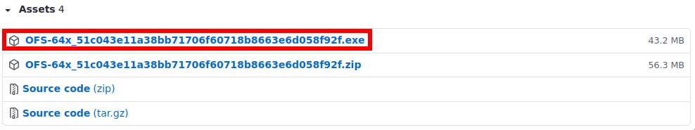
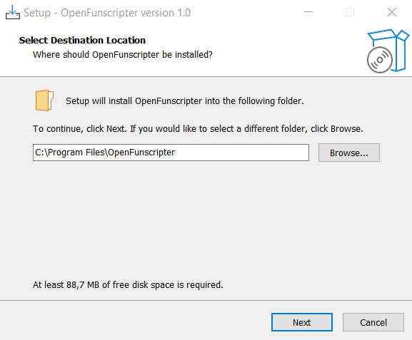
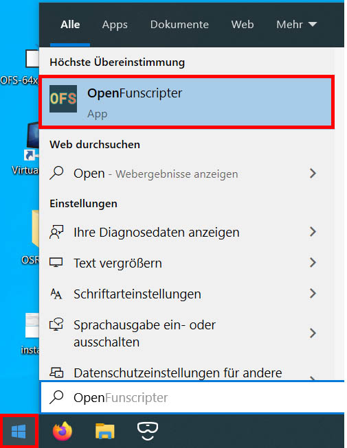
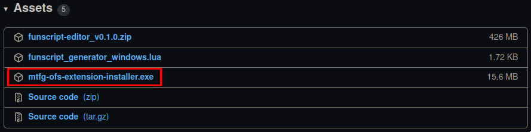
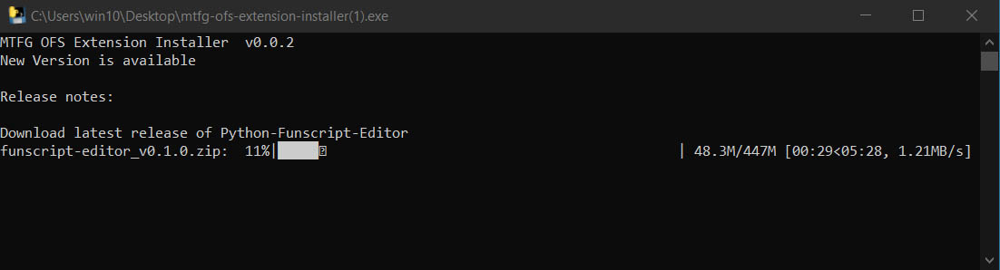
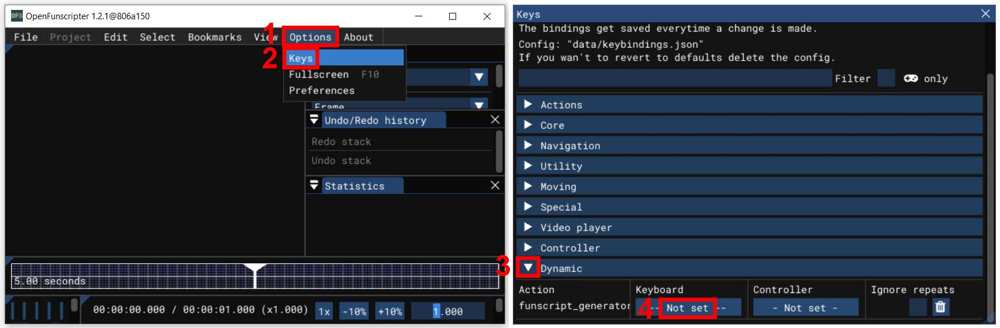

# Open Funscripter Integration

## Installation Windows (Easy)

This method use an installer that check for the latest release on GitHub and automatically update the existing Motion Tracking Funscript Generator (MTFG) OFS Extension on your computer. If you want to make an clean install of the MTFG OFS Extension you can delete the existing folder `Funscript Generator Windows` in `%APPDATA%\OFS\OFSX_data\extensions` (the `X` in `OFSX_data` is an placeholder for your OFS Version) before running the installer.

**Installation:**

1. Download OFS from https://github.com/OpenFunscripter/OFS/releases. **(min required OFS Version 2.0.0!!!)**
   <br> 
2. Install OFS
   <br> 
3. Start OFS at least once and close it again.
   <br> 
4. Download the **latest** MTFG OFS Extension Installer from https://github.com/michael-mueller-git/Python-Funscript-Editor/releases.
   <br> 
5. Execute the downloaded executable. Wait for the installation to complete.
   <br> 
6. Open OFS, activate the extension (3) and enable the window (4). Now you can use the extension at any position in the Video with the _Start MTFG_ Button (5). On slow computers, the program may take several seconds to start!. Before you press the _Start MTFG_ Button you have to open a video in OFS else you get only the Message Box "Video file was not specified!".
   <br> 
7. **Optional**: Add global key binding for the extension in OFS.
   <br> 

<br>

### What does the installer do?

This section for technical interested people who want to understand the installation process. The source code of the installer is in the [`contrib/Installer`](https://github.com/michael-mueller-git/Python-Funscript-Editor/tree/main/contrib/Installer) directory of this repository. The installer perform the following Steps:

1. Check if the OFS Extension Directory `%APPDATA%\OFS\OFSX_data\extensions` exists (the `X` in `OFSX_data` is an placeholder for your OFS Version).
2. Fetch the latest release Version from github rest api.
3. Check if an (older) MTFG Version is already installed in the OFS Extension Directory: If we have already the latest version installed, we are done here
4. The installer download the latest release version from github.
5. After the download complete we extract the latest release to the OFS Extension Directory (Installation of the latest release).

<br>

## Installation Windows (Manually)

If the installer not work for you, you can try to install the MTFG manually.

Disadvantages with manual installation:

- No update function available, you have to update the Program according this manual install instruction.

Manual Installation:

1. Download OFS from https://github.com/OpenFunscripter/OFS/releases. **(min required OFS Version 2.0.0!!!)**
   <br> 
2. Install OFS
   <br> 
3. Start OFS at least once and close it again.
   <br> 
4. Determine OFS extension directory in `%APPDATA%\OFS`. For OFS Version 3 the `OFS_EXTENSION_PATH` is `%APPDATA%\OFS\OFS3_data\extensions`.
5. Download the application `funscript-editor_vx.x.x.zip` from `https://github.com/michael-mueller-git/Python-Funscript-Editor/releases`.
6. Open your File Explorer and navigate to `%OFS_EXTENSION_PATH%` (determined in step 4).
7. Create an directory for the Extension with the name `Funscript Generator Windows`.
8. Create an other directory inside the `Funscript Generator Windows` directory with the Name `funscript-editor`.
9. Extract the Downloaded `funscript-editor_vx.x.x.zip` into `%OFS_EXTENSION_PATH%\Funscript Generator Windows\funscript-editor`.
10. Now check that the file `%OFS_EXTENSION_PATH%\Funscript Generator Windows\funscript-editor\funscript-editor.exe` exists.
11. Copy the content from `%OFS_EXTENSION_PATH%\Funscript Generator Windows\funscript-editor\OFS` to `%OFS_EXTENSION_PATH%\Funscript Generator Windows` and override existing files.
12. Now check that the file `%OFS_EXTENSION_PATH%\Funscript Generator Windows\main.lua` exists.
13. Open OFS, activate the extension (3) and enable the window (4). Now you can use the extension at any position in the Video with the _Start MTFG_ Button (5). On slow computers, the program may take several seconds to start!. Before you press the _Start MTFG_ Button you have to open a video in OFS else you get only the Message Box "Video file was not specified!".
    <br> 

<br>

## Installation Linux

Yo can use my OFS Fork with nix support. My OFS Fork includes the MTFG Extension by default. For nix setup with flake read https://github.com/mschwaig/howto-install-nix-with-flake-support/blob/main/README.md

```sh
nix run github:michael-mueller-git/OFS --refresh
```

Limitation: The nix package is stored in a read only filesystem path. You can currently not change the config files for MTFG.

<br>

## Troubleshot

### When calling the generator, only a message box is displayed with the message: "Video file was not specified!"

In some cases OFS does not set the path to the video file within the lua script correctly (the variable `VideoFilePath` is empty). This could be happen when the video path contains some special character. **Rename your video files and store them in a path without special character**. Then the variable should be set by OFS and the motion tracking funscript generator should work. If you still get the error message try to restart OFS and wait about 30 seconds before starting MTFG to ensure OFS is fully initialized.

### Tracking stops automatically

If a tacker does not find the selected feature in the next frame, the tracking process stops. If more than 90 frames have already been tracked, a window appears to select the minimum and maximum value in which the reason for the abort is displayed with e.g. `Info: Tracker Woman Lost`.

If less than 90 frames have been processed, a message box should pop up with the message `Tracking time insufficient`. In this case, no output is generated because there is not enough data for the algorithm to work with.

### Tracking stops very often

The selection of the tracking feature is tricky and requires some practice and experience. For a good tracking result, unique features in the video should be selected near the desired tacking position.
