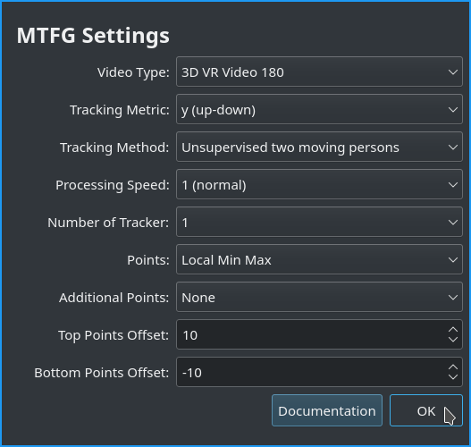

# Usage

If you want to use this application, I assume that you already know the basic scripting procedures. If this is not the case, please learn first the basic functions how to create a funscript!

First of all I want to mention that this application is not a fully automated solution, it's just an extension that helps you scripting **static camera scenes** much faster.

## Process

1. Select the Region of Interest in the Video where the action happens.
2. Select an features for the Woman and Men in the video, which should be tracked.
3. The application try to track the selected feature in the following video frames.
4. When the user stop the Tracking or the application can not find the selected feature in the next video frame the application calculate the difference between the predicted tracking boxes for each frame.
5. The user set the minimum and maximum position for the tracked video sequence.
6. The Application determine all local min and max points of the movement of the tracker and insert them in OpenFunscripter.

## Options

## Unsupervised vs. Supervised Tracking

The Unsupervised Tracking simply track the selected feature in the video until the feature is not visible anymore or the user stop the tracking process.

The supervised tracking expand this function by an user input of an search area. As soon as the predicted tracking box leaves this area, we can trigger an event. This event can currently represent either an abort condition for the tracking or an ignore condition. Therefore you have to define the region where you expect the selected features in the future video frames for each tracked feature when you select the supervised tracking option. When you use the supervised tracking process as abort condition it will increases the quality of the generated funscript actions due to the additional quality check. With the ignore condition we ignore all tracking prediction outside the specified area and use the last valid tracking position inside the specified area until the tracking insert the defined supervised tracking area again. This method is useful to script actions where the actor not always have contact.

## Settings

All important settings can be set in the settings dialog before the tracking starts.
